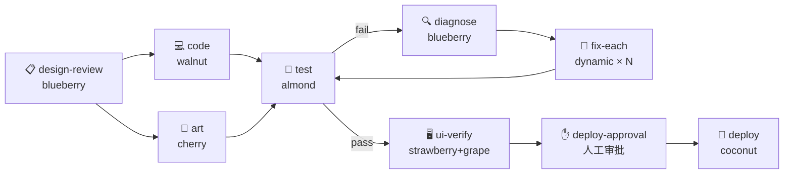
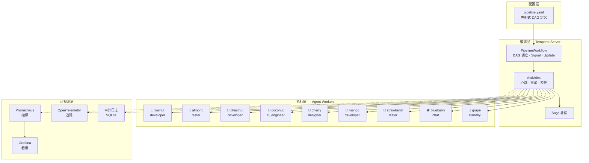

# 🎻 Agent Orchestra

> **像 Kubernetes 管理 Pod 一样管理 AI Agent。**
>
> 声明式 YAML 定义流水线 → Temporal 驱动执行 → MCP 通信 Agent → Prometheus/OTel 可观测。

<p align="center">
  
  
  
  
  
  
</p>

---

## 一句话说清楚

| 你要做的事 | 用什么 |
|-----------|--------|
| 搭一个聊天机器人 / RAG 问答 | Dify |
| 编排 LLM 调用链（prompt → tool → prompt） | LangChain / LangGraph |
| 管理一支 AI Agent 团队完成工程任务 | **Orchestra** 🎻 |

**Orchestra 不是 chatbot builder，是 AI Agent 团队的 CI/CD 引擎。**

---

## 一分钟看懂

```yaml
# game-dev.pipeline.yaml
apiVersion: orchestra.io/v1
kind: Pipeline
metadata:
  name: game-dev
spec:
  agents:
    walnut:  {role: developer,  capabilities: [godot, gdscript]}
    chestnut:{role: tester,     capabilities: [pytest, coverage]}
    coconut: {role: ci_engineer, capabilities: [docker, deploy]}

  pipeline:
    stages:
      - name: code
        agent: walnut
        input: "$.params.task"
        output: "$.code.patch"

      - name: test
        dependsOn: [code]
        agent: chestnut
        input: "$.code.patch"
        output: "$.test.result"

      - name: deploy
        dependsOn: [test]
        agent: coconut
        input: "$.code.patch"
        output: "$.deploy.url"
```

```bash
orchestra submit game-dev.pipeline.yaml -p task="修复 BUG-041：字体丢失"
orchestra status --watch
```

核桃写代码 → 栗子跑测试 → 椰子部署，一条命令，自动串起来。

### 流水线执行流程



> **condition 分支** · **parallel fan-out** · **dynamic for_each** · **人工审批** · **失败补偿**

### 终端演示

[](https://github.com/StewartXiang/orchestra)

```bash
$ orchestra validate examples/flappybird.pipeline.yaml
✓ 校验通过 (0 errors, 0 warnings)

$ orchestra dry-run examples/flappybird.pipeline.yaml --param gdd="复刻 Flappy Bird"
  Topo: [design-review, code, art, test, diagnose, fix-each, ui-verify, deploy-approval, deploy]
  Wave 1: [design-review]
  Wave 2: [code, art]
  Wave 3: [test]
  Wave 4: [diagnose, ui-verify]
  Wave 5: [deploy-approval]
  Wave 6: [deploy]

$ orchestra submit examples/flappybird.pipeline.yaml --param gdd="..."
✓ submitted
  workflow_id : flappybird-dev-3f7a2b1c
  run_id      : 3f7a2b1c
  task_queue  : agent-blueberry

$ orchestra status --watch
  phase=Succeeded  stage=deploy  progress=100%  eta=—
```

---

## 解决什么痛点

| 手工编排的痛 | Orchestra 怎么解决 |
|---|---|
| 依赖手工排序、容易出错 | **声明式 YAML DAG**，自动解析拓扑 |
| Agent 宕机不知道 | **15s 心跳 + 三层探针**，自动故障转移 |
| 失败靠人手动重试 | **指数退避自动重试** + Saga 补偿 |
| 没有执行历史 | **Temporal Event History** 全量审计 |
| 多人并发抢占一个 Agent | **Task Queue 隔离** + maxConcurrency 限流 |
| 流程没法版本化 | Pipeline YAML **纳入 Git 版本控制** |

---

## 与 Dify / LangGraph / CrewAI 的差异

| 维度 | Dify | LangGraph | CrewAI | **Orchestra** |
|------|------|-----------|--------|---------------|
| **定位** | LLM 应用平台 | LLM 图状态机 | Agent 角色协作 | Agent 流水线引擎 |
| **编排粒度** | LLM 调用 | LLM 调用 + 状态 | Agent + Task | Agent + Stage + DAG |
| **执行引擎** | 自研轻量 | 单进程 | 单进程 | **Temporal**（工业级） |
| **断点续传** | ❌ | 有限 | ❌ | ✅ Event History Replay |
| **Saga 补偿** | ❌ | ❌ | ❌ | ✅ 部署失败自动回滚 |
| **多 Agent 并行** | ❌ | ❌ | 有限 | ✅ DAG 扇出 + 投票聚合 |
| **人工审批节点** | ❌ | ❌ | ❌ | ✅ any/all/quorum |
| **Serverless 友好** | ❌ | ✅ | ✅ | ✅ Worker 按需扩缩 |
| **代码量** | 40万+ 行 | ~3 万行 | ~2 万行 | **~1 万行** |

---

## 架构



> 四层架构对标 Kubernetes 控制面/数据面分离。编排层用 Temporal 做持久化执行内核，Agent 通过 MCP 协议零侵入接入。

### 技术选型

| 层 | 选型 | 原因 |
|---|------|------|
| 编排内核 | **Temporal** | 持久化 Workflow、Replay、Signal、Saga |
| Agent 通信 | **MCP**（Model Context Protocol） | 标准协议，与 Agent 实现解耦 |
| 流水线定义 | **自研 YAML DSL** | 参考 K8s CRD + LangGraph 节点/边模型 |
| 可观测性 | **Prometheus + Grafana + OTel** | 工业标准，无需自建 |
| 持久化 | **SQLite**（起步）/ PostgreSQL（生产） | Temporal 自带，零配置 |

### K8s 启发的设计

| K8s 概念 | Orchestra 对应 |
|----------|---------------|
| Pod 声明式定义 | `agents:` YAML |
| Liveness/Readiness Probe | Agent 心跳监控 + 健康检查 |
| Service 发现 | Agent 能力路由（`agentSelector`） |
| Job | Pipeline 提交执行 |
| CronJob | Schedule 定时触发 |
| ResourceQuota | Agent maxConcurrency |
| Operator + CRD | Pipeline / PipelineRun / AgentProfileSet |

---

## 快速开始

### 方式 A：Demo 模式（推荐首次体验，1 分钟跑通）

**无需任何外部 Agent。** 仓库自带 demo agent，`docker compose up` 即可体验完整流水线。

```bash
# 1. 启动 Demo 环境（Temporal + 内置 Demo Agent + Worker）
docker compose -f deploy/docker-compose.demo.yml up -d

# 2. 安装 CLI
pip install -e .

# 3. 提交 Demo 流水线
orchestra submit examples/minimal-demo.pipeline.yaml --param task="hello world"

# 4. 查看结果
orchestra status --watch
open http://localhost:8080   # Temporal UI
```

### 方式 B：生成你自己的流水线

```bash
# 交互式生成配置（询问项目名称、Agent、Stage）
orchestra init

# 验证并运行
orchestra validate my-pipeline.pipeline.yaml
orchestra dry-run  my-pipeline.pipeline.yaml
orchestra submit   my-pipeline.pipeline.yaml --values values.yaml
```

### 方式 C：连接真实 Agent（生产部署）

```bash
# 1. 编辑 config/profiles.yaml，填入你的 Agent MCP endpoint
# 2. 启动全套服务栈
docker compose -f deploy/docker-compose.yml up -d

# 3. 提交
orchestra submit examples/game-dev.pipeline.yaml --param gdd="..."
```

### 面板地址

| 面板 | Demo | 生产 |
|------|------|------|
| Temporal UI | http://localhost:8080 | 同 |
| Grafana | — | http://localhost:3000 |
| Prometheus | — | http://localhost:9090 |

---

## Pipeline YAML 速览

### 基础 DAG

```yaml
stages:
  - name: design
    agent: mango
    output: "$.gdd"
  - name: code
    agent: walnut
    dependsOn: [design]
    input: "$.gdd.task"
    output: "$.code.patch"
  - name: test
    agent: chestnut
    dependsOn: [code]
    input: "$.code.patch"
```

### 并行 + 投票聚合

```yaml
- name: ui-verify
  agents: [strawberry, grape]
  aggregateStrategy: vote       # all | any | first | merge | vote | quorum
```

### 条件分支

```yaml
- name: fix
  agent: walnut
  dependsOn: [test]
  condition: 'test.result == "fail"'    # false → SKIPPED，不阻塞后续
```

### 人工审批

```yaml
- name: deploy-approval
  dependsOn: [ci-gate]
  approval:
    approvers: [ou_alice]
    policy: any
    timeout: 1h
    onTimeout: reject
```

### 动态展开（for_each）

```yaml
- name: fix-each
  dependsOn: [diagnose]
  dynamic:
    generator: for_each
    input: "$.diagnose.bugs"    # 按 Bug 列表动态生成子 Stage
    maxParallel: 3
    template:
      name: "fix-bug-{{ item.id }}"
      agent: walnut
```

---

## 项目结构

```
docs/          需求 / 设计 / 架构 / 使用文档（共 4 份，3 万+ 字）
schema/        JSON Schema（pipeline / pipeline-run / agent-profile）
config/        Agent profiles + capabilities 词表
examples/      示例流水线（minimal-demo / game-dev / flappybird / parameterized）
deploy/        Docker Compose（demo / 生产）+ Prometheus + Grafana + OTel
scripts/       demo_agent.py（内置 mock Agent，开箱即用）
src/
  domain/      领域模型（Agent / Pipeline / Stage / State / Errors）
  schema/      YAML 解析 / JSONPath / DAG 拓扑 / CEL 表达式 / 模板
  workflows/   PipelineWorkflow（Temporal Workflow 实现）
  activities/  Agent Task / Artifact / Compensation / Notification
  adapters/    Agent 通信适配器（MCP / Mock；Protocol 可扩展）
  state/       幂等键 / Artifact 存储
  observability/ 日志 / 指标 / 追踪 / 审计
  worker/      Worker 进程 + 生命周期 + 注册
  cli/         CLI 命令（validate / submit / status / approve / schedule）
tests/         单元 / 集成 / Replay / Chaos / Load
runbook/       故障处置 SOP
```

---

## Agent 管理

内置 9 个 Agent Profile，按能力路由：

| Agent | 角色 | 能力 | 模型 |
|-------|------|------|------|
| 🥜 核桃 walnut | developer | godot, gdscript, git | deepseek-v4-pro |
| 🧪 杏仁 almond | tester | pytest, coverage, playwright | deepseek-v4-pro |
| 🌰 栗子 chestnut | developer | python, web, fastapi | deepseek-v4-pro |
| 🥥 椰子 coconut | ci_engineer | docker, deploy, k8s | deepseek-v4-pro |
| 🍒 樱桃 cherry | designer | ui-design, figma, asset-export | deepseek-v4-pro |
| 🥭 芒果 mango | developer | godot, shader, gameplay | deepseek-v4-pro |
| 🍓 草莓 strawberry | tester | playwright, ui-test, e2e | deepseek-v4-pro |
| 🫐 蓝莓 blueberry | chat | summarize, translate, analyze | deepseek-v4-pro |
| 🍇 葡萄 grape | standby | generic, fallback | deepseek-v4-pro |

---

## 开发

阅读 [`CLAUDE.md`](CLAUDE.md) 了解项目宪法（确定性铁律 / 幂等铁律 / 测试策略）。

```bash
# 安装开发依赖
pip install -e ".[dev]"

# 运行测试
pytest
pytest -m "not integration"  # 仅单元测试

# 代码检查
ruff check src/ tests/
mypy src/
```

---

## License

Apache 2.0 © Agent Orchestra Contributors
